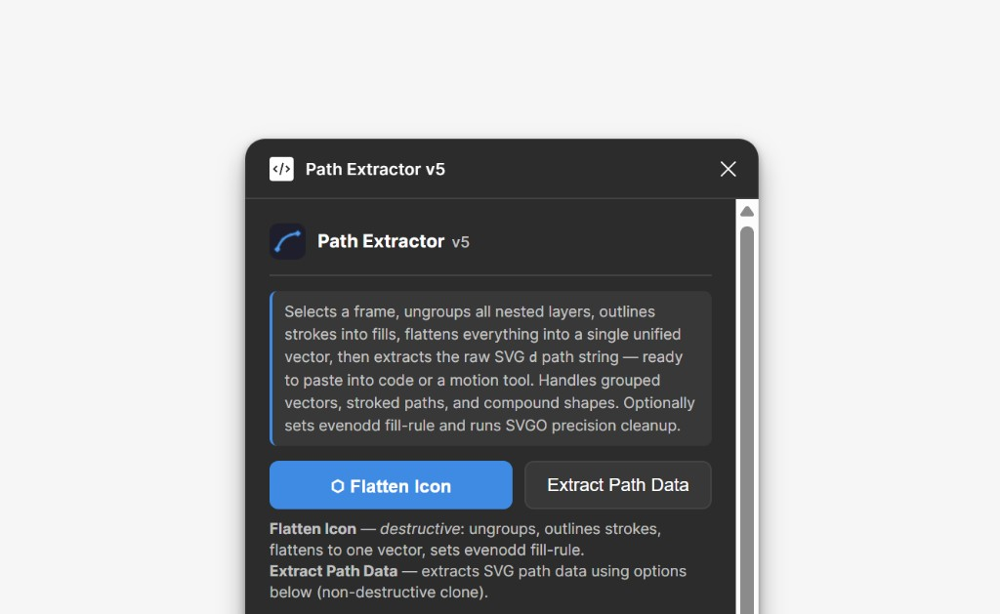
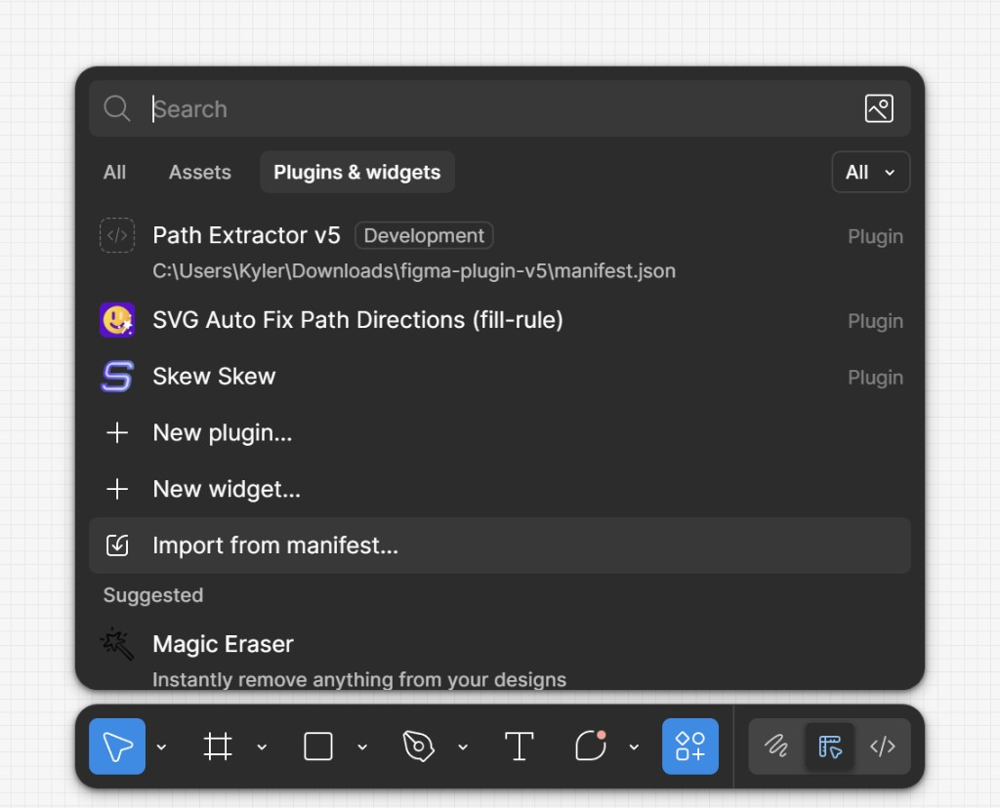
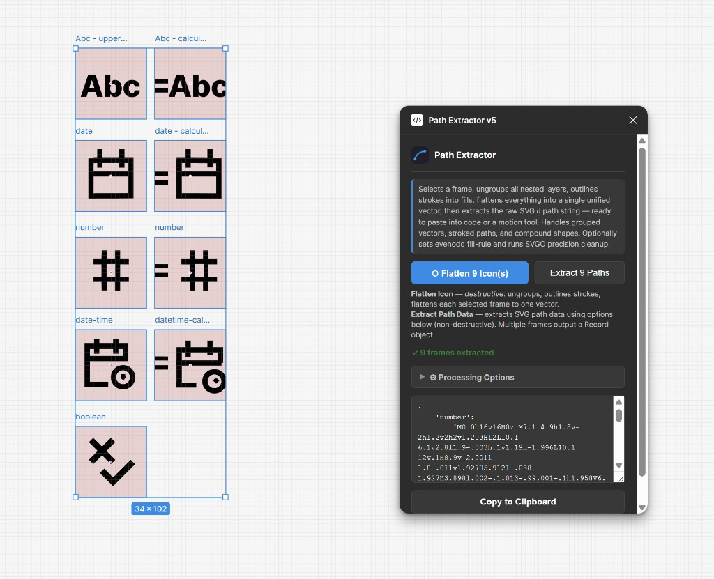

# Path Extractor



A Figma plugin that selects a frame, ungroups all nested layers, outlines strokes into fills, flattens everything into a single unified vector, and extracts the raw SVG `d` path string — ready to paste into code or a motion tool.

Handles grouped vectors, stroked paths, and compound shapes. Runs SVGO precision cleanup on the output.

## Features

- **Flatten Icon** — destructively ungroups, outlines strokes, and flattens a selected frame into one vector
- **Extract Path Data** — non-destructive extraction of the SVG path `d` attribute from a cloned frame
- **Stroke Outlining** — automatically converts all strokes to filled shapes before flattening
- **SVGO Optimization** — configurable decimal precision for clean, compact path data
- **Debug Log** — toggleable log showing each processing step

## Importing to Figma

This plugin uses the **manifest import** method for local development:

1. **Install dependencies and build:**

   ```bash
   npm install
   node build.mjs
   ```

2. **Open Figma Desktop** and go to **Plugins & widgets** → **Import from manifest…**



3. **Browse** to the `manifest.json` file inside this project folder and select it.

4. The plugin will appear under **Plugins** → **Development** → **Path Extractor**.

5. To run it, select a frame on your canvas, then launch the plugin from the menu.

> **Note:** After making code changes, run `node build.mjs` again. Close and reopen the plugin in Figma to pick up the new build — you do not need to re-import the manifest.

## How to Flatten an Icon

<video src="assets/flatten-demo.mp4" controls width="600"></video>

## Multi-Frame Export

Select multiple frames and click **Extract Path Data** to generate a ready-to-use object with each frame's path data keyed by its name (converted to kebab-case). Duplicate names are automatically suffixed with `-2`, `-3`, etc.



The output looks like:

```typescript
{
    'date':
        'M1.5 3.5h13v11h-13z...',
    'date-calculate':
        'M5 7h2v1.5H5z...',
    'number':
        'M0 0h16v16H0z...',
}
```

Both **Flatten Icon** and **Extract Path Data** support multi-selection — the buttons update to show how many frames are selected.

## Usage

1. Select one or more **Frames** on the canvas.
2. Click **Flatten Icon** to destructively merge everything into one vector, or **Extract Path Data** to get the SVG path without modifying the original.
3. When multiple frames are selected, **Extract Path Data** outputs a Record object with kebab-case frame names as keys.
4. The extracted path string appears in the text area — click **Copy to Clipboard** to grab it.

## Project Structure

```
figma-plugin-v5/
├── manifest.json        # Figma plugin manifest
├── build.mjs            # ESBuild bundler script
├── package.json         # Dependencies
├── src/
│   ├── code.ts          # Plugin sandbox logic (flatten, outline, extract)
│   ├── ui.ts            # UI event handling and messaging
│   └── ui.html          # Plugin UI layout and styles
└── dist/                # Built output (generated)
```
